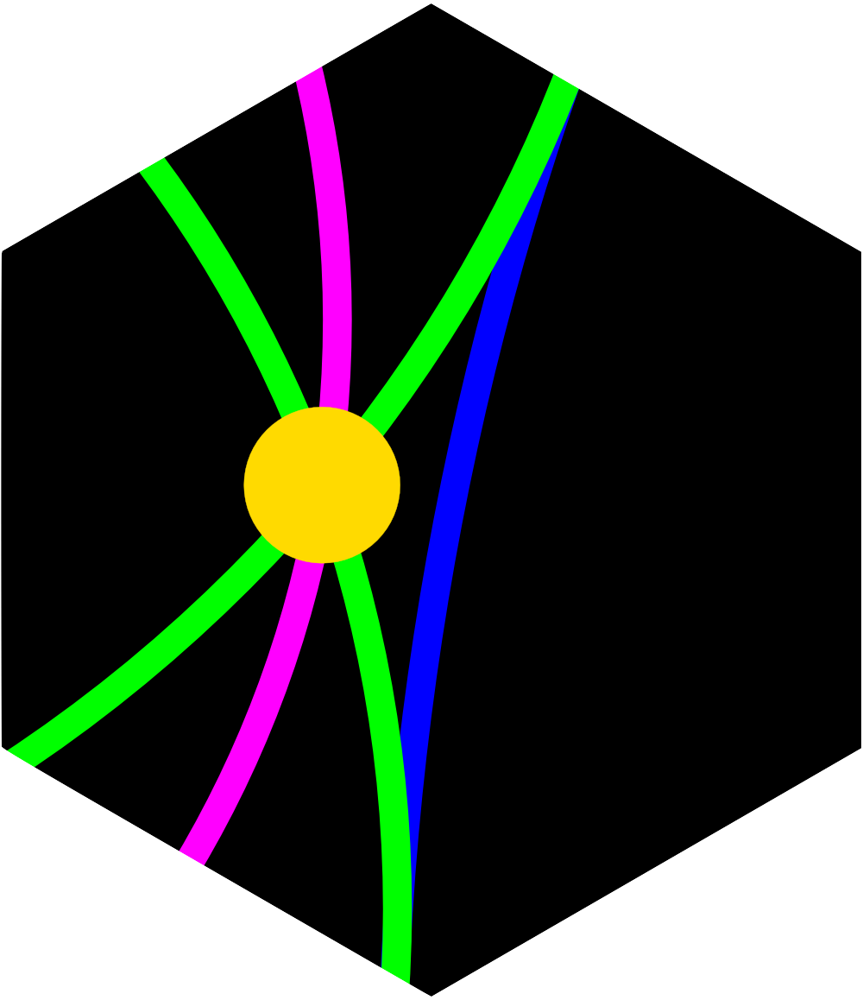
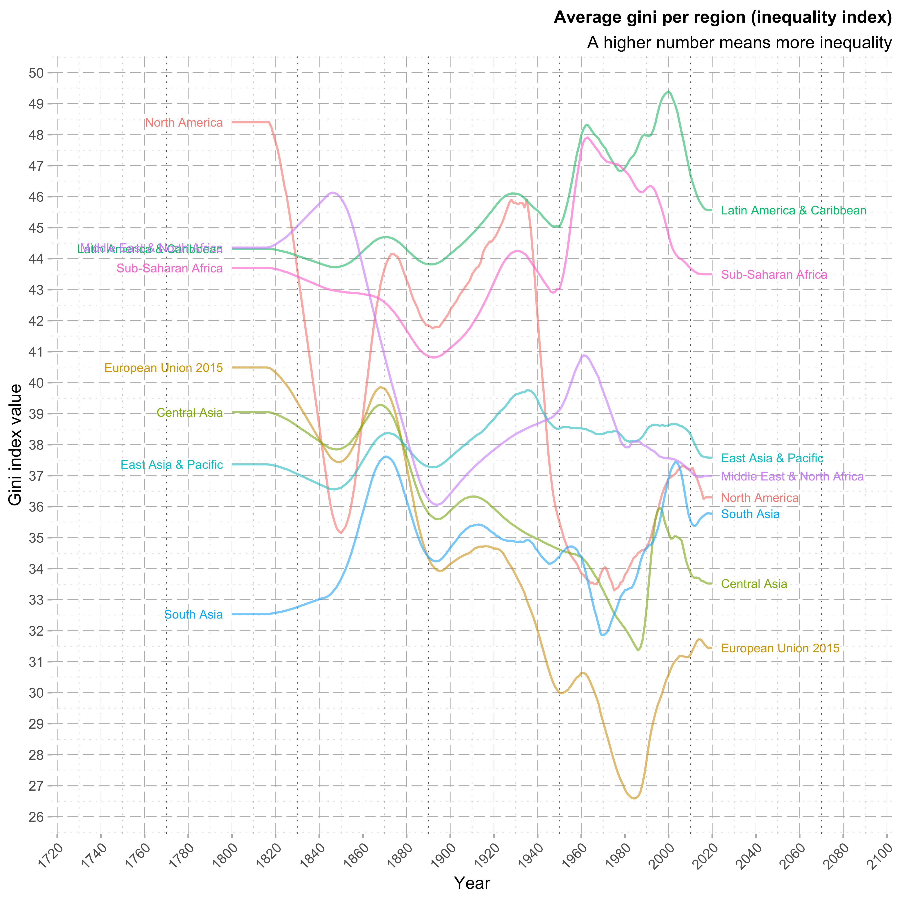
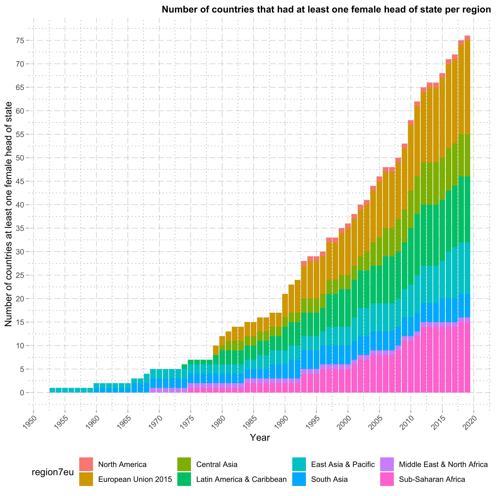
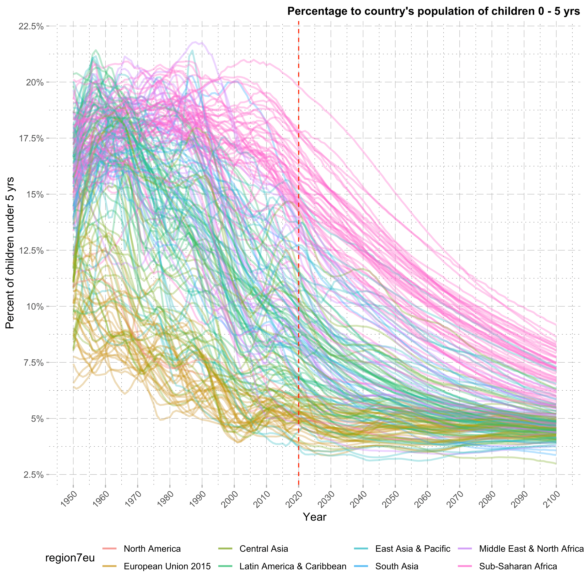
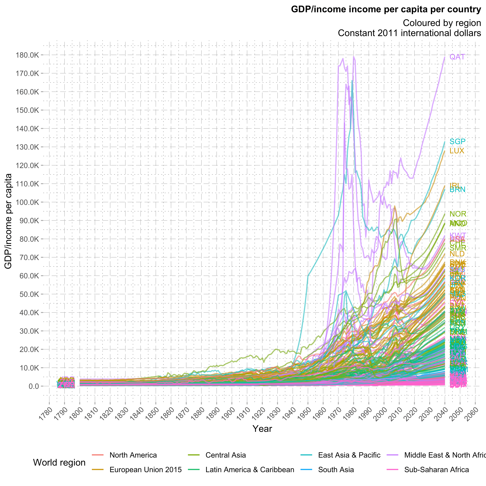
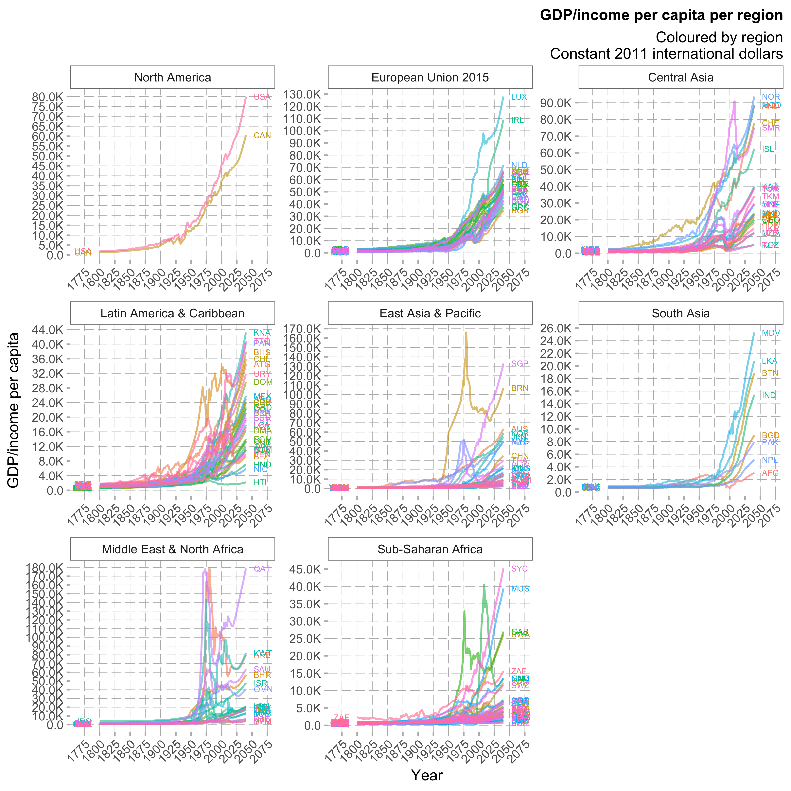
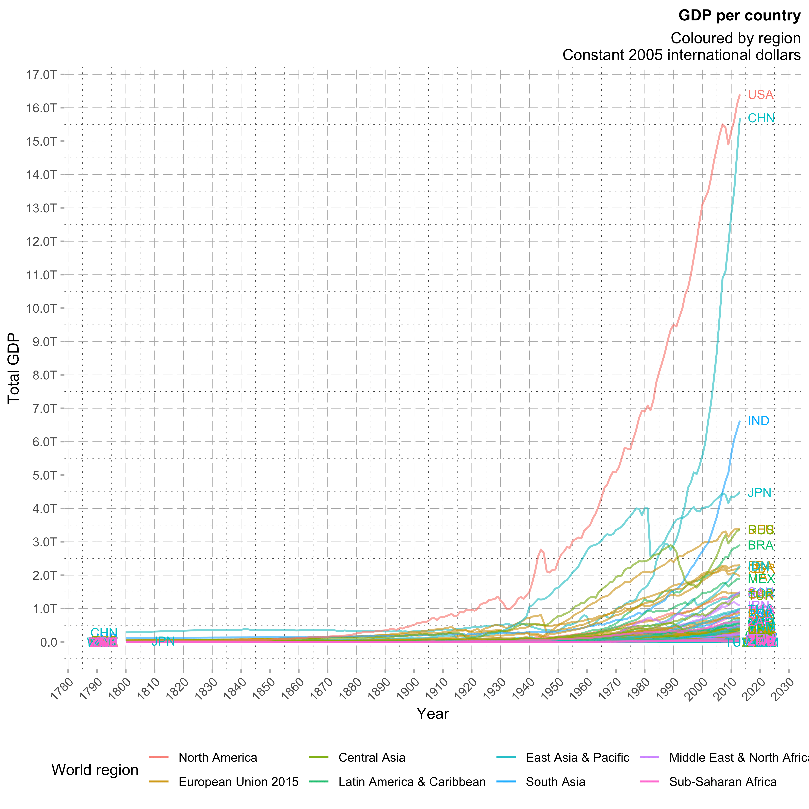
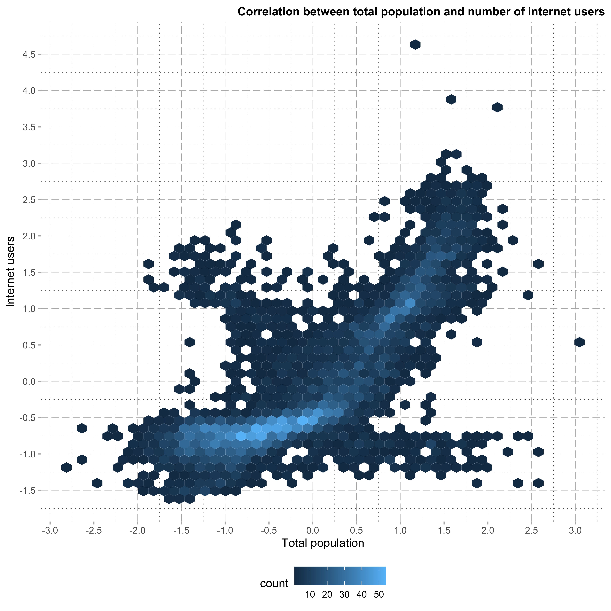

## ultraPlot  

Single function `R` package for applying the theme and style of Ultrachord to `ggplot2` plots.

## Install ultraPlot

```r
# install.packages('devtools')
devtools::install_github('ultrachord/ultraPlot')
```

## Using the functions

Example of how it is used in a standard workflow:

```r
iris |>
	ggplot2::ggplot(ggplot2::aes(x = Sepal.Length, y = Sepal.Width)) +
	ggplot2::geom_point(ggplot2::aes(color = Species, shape = Species)) +
	ggplot2::labs(title = "Iris data", subtitle = "Classic data", x = "Sepal Length", y = "Sepal Width") +
	ggplot2::facet_grid(~ Species) +
	ultraPlot::theme_ultrachord()

data.frame(year = time(nhtemp), tmps = as.matrix(nhtemp)) |>
	ggplot2::ggplot(ggplot2::aes(x = year, y = tmps)) +
	ggplot2::geom_line() +
	# ggplot2::geom_hline(yintercept = 0, size = 1, colour = "#333333") +
	ggplot2::labs(title = "New Hampshire yearly temperatures", subtitle = "Collected between 1912 and 1971", x = "Year", y = "Average temperature") +
	ultraPlot::theme_ultrachord()
```

## Example plots

<p align="center">
    
    
    
    
    
    
    
</p>
